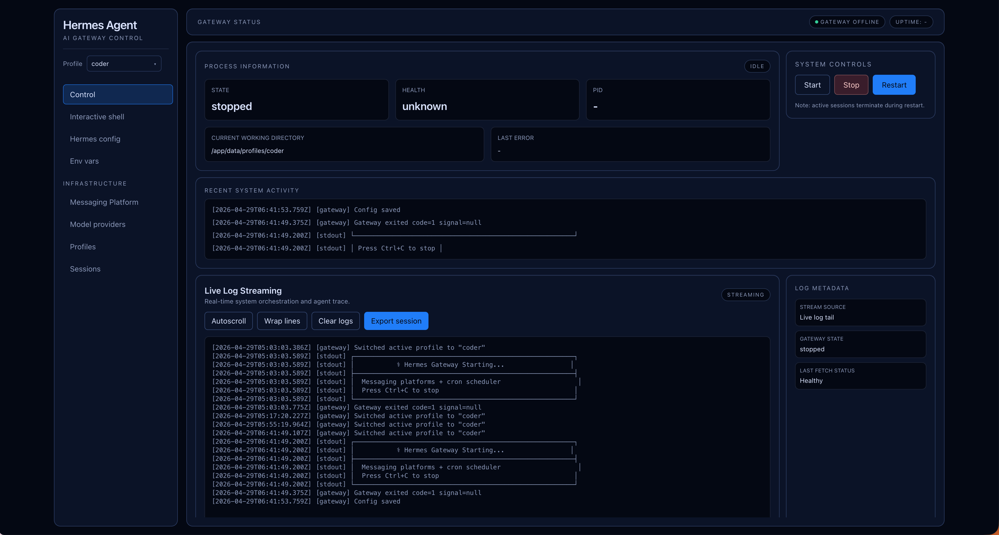
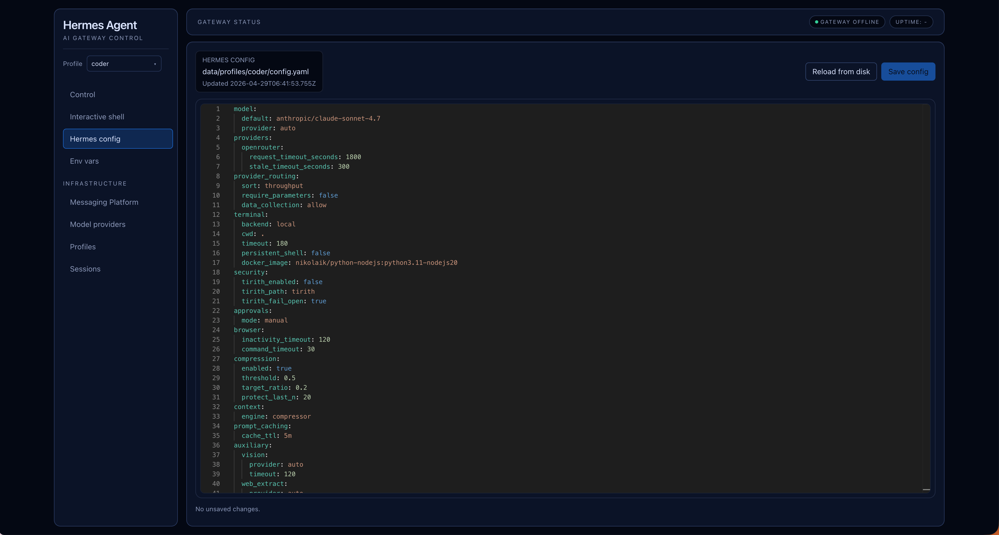
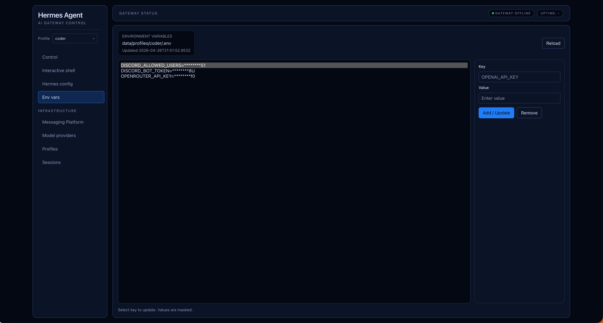
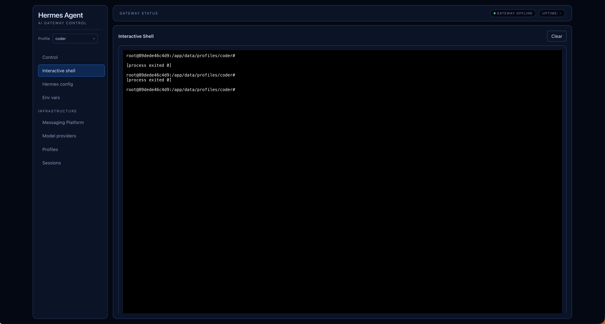
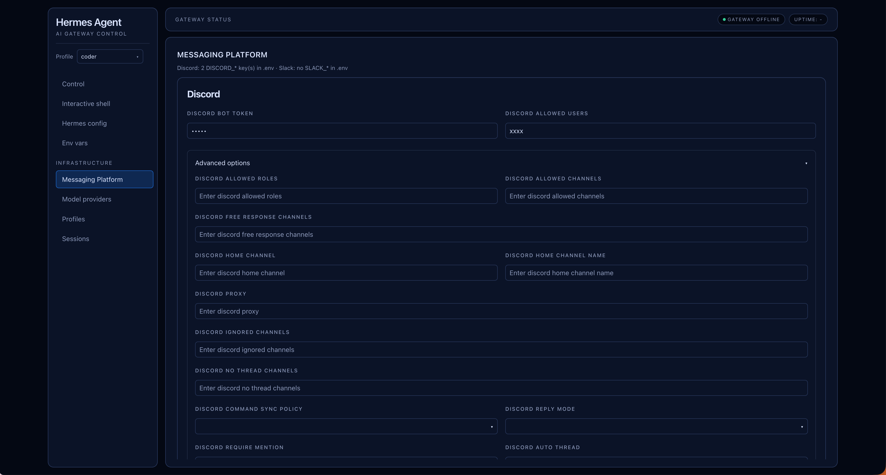
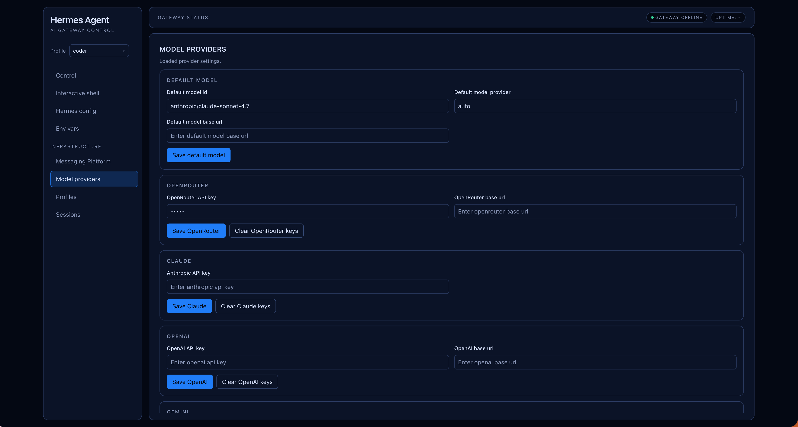
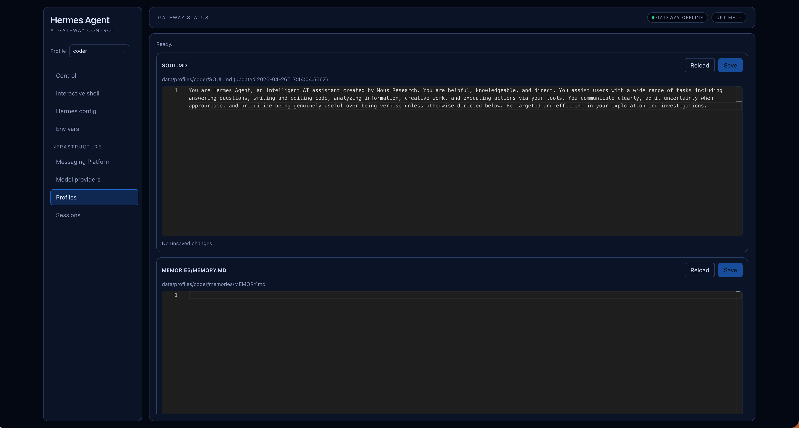

# Hermes Agent Control Plane

A production-ready control plane and web UI for Hermes Gateway operations, built with a Framer-inspired dark interface and practical day-to-day tooling for operators.

## What you get

- Managed gateway lifecycle: start, stop, restart, and monitor status.
- Live observability via streaming logs and a browser-based interactive shell.
- Monaco-powered config editing for YAML, profile files, and env variables.
- Profile-centric workflows with active-profile switching and content editing.
- Basic Auth protection across HTTP, SSE, and WebSocket transport.

---

## Product Tour

### 1) Control Center

Operate the gateway process from a single dashboard with clear controls and runtime visibility.



### 2) Configuration Editor

Edit gateway YAML safely in Monaco with syntax support and write flows designed for reliable persistence.



### 3) Environment Variables

Manage persisted runtime environment values directly in the UI.



### 4) Interactive Shell

Use an in-browser terminal powered by xterm.js and a server-side PTY bridge.



### 5) Messaging Platform Setup

Configure messaging-related integrations from the same control plane.



### 6) Model Provider Configuration

Configure and manage model-provider settings in a dedicated workflow.



### 7) Profile Management

Create, clone, switch, and maintain profiles. The active profile re-targets config, env, messaging, and shell contexts to the selected `HERMES_HOME`.



---

## Quick Start

### Prerequisites

- Docker + Docker Compose, or
- Node.js 20.x (see `engines` in `package.json`)

### Docker Compose (recommended)

```bash
docker-compose up -d
```

Open [http://localhost:3000](http://localhost:3000).

Default credentials from `docker-compose.yml`:

- Username: `admin`
- Password: `hermes_secret`

Override with `ADMIN_USERNAME` and `ADMIN_PASSWORD`.

Runtime state is mounted at `./data` -> `/app/data` in the container (`HERMES_HOME=/app/data`).

### Local Development

```bash
export ADMIN_USERNAME=admin
export ADMIN_PASSWORD=your_password
export PORT=3000
npm install
npm run dev
```

`npm run dev` runs the TypeScript server with watch mode (`tsx watch`), so no separate build step is needed during iteration.

### Local Production Simulation

```bash
npm install
npm run typecheck
npm run build
npm test
npm start
```

`npm start` runs `node dist/index.js`.

---

## Scripts

| Command | Purpose |
| --- | --- |
| `npm run dev` | Start development server with watch |
| `npm run build` | Build server and client assets into `dist/` |
| `npm start` | Run production entrypoint (`dist/index.js`) |
| `npm test` | Run Vitest suite |
| `npm run typecheck` | Run TypeScript checks (`tsc --noEmit`) |
| `npm run lint` | Run Oxlint |
| `npm run format` | Run Oxfmt |

---

## Architecture Snapshot

- Runtime: Node.js 20+ with [Hono](https://hono.dev/).
- UI: Server-rendered HTML + [htmx](https://htmx.org/), Tailwind CSS, targeted TypeScript client modules, Monaco, and xterm.js.
- Storage: Data persisted under `data/` locally (or `/app/data` in Docker).
- Reliability: Atomic temp-file + rename flows for sensitive writes (for example config and profile markdown files).

---

## Security Notes

- Basic Auth is enforced for HTTP routes, SSE streams, and WebSocket connections.
- Profile and filesystem input paths are sanitized to block traversal.
- Treat logs, profile content, and configuration as sensitive operational data.

---

## License

MIT
